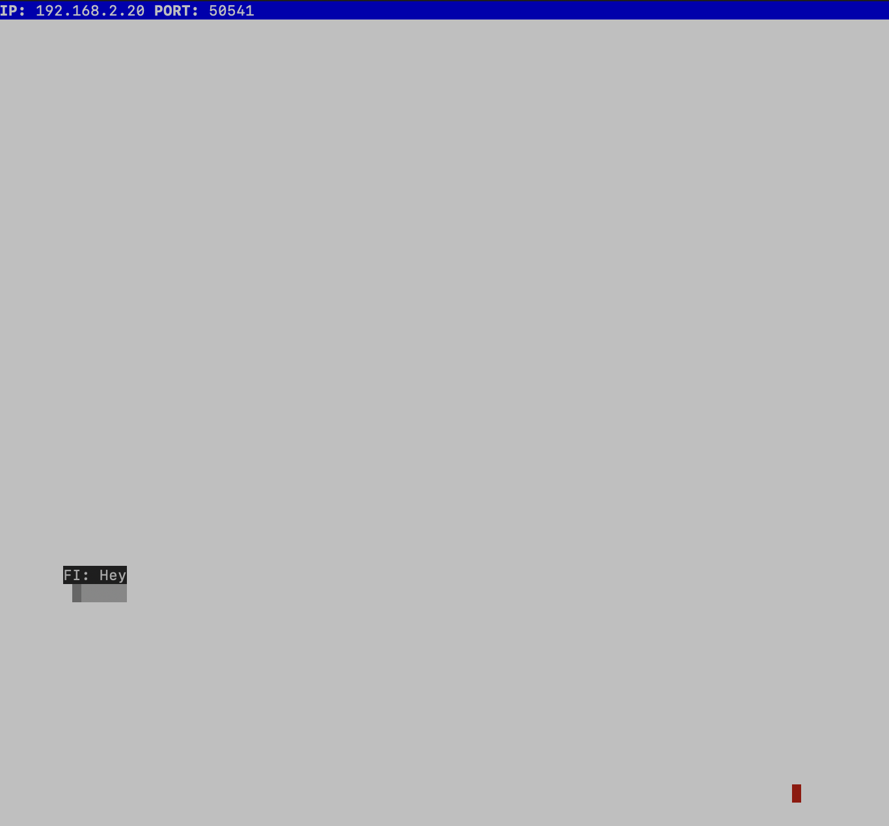

# Snake Client Project

Snake game is a very popular video game. It is a video game concept where the player maneuvers a dot and grows it by ‘eating’ pieces of food. As it moves and eats, it grows and the growing snake becomes an obstacle to smooth maneuvers. The goal is to grow it to become as big as possible without bumping into the side walls, or bumping into itself, upon which it dies.

This is simply a multiplayer take on the genre.

Before you can run this client, you will need to be running the server side which you can download and install from [here](https://github.com/taniarascia/snek).

## Final Product

## Getting Started

- Follow steps inside the snek server repo to run the server side
- Open another termoinal window side by side with the server side.
- Run the development snake client using the `node play.js` command in the new terminal window.
- You will see the snake apear on the screen with a player's initials on the screen and a small message
- Start playing the game using WASD keys:
  - W for moving the snake one bit UP from its current position
  - A for moving the snake towards LEFT one bit from its current position
  - S for moving the snake one bit DOWN from its current position
  - D for moving the snake towards RIGHT one bit from its current position
- You can press spacebar to show a special message fromthe player.
- If you want to change the initials of the player you can do so by going into the constants.js file and changing the string of const PLAYER_NAME
- If you want to change the message from the player using spacial key (space bar) you can do so by going into the constants.js file and changing the string of const PLAYER_NAME